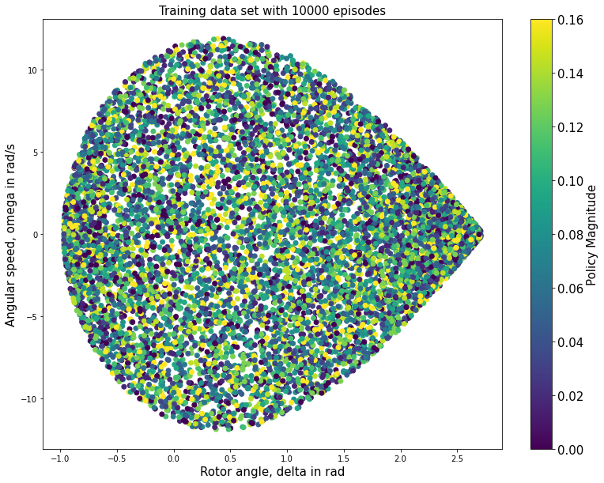
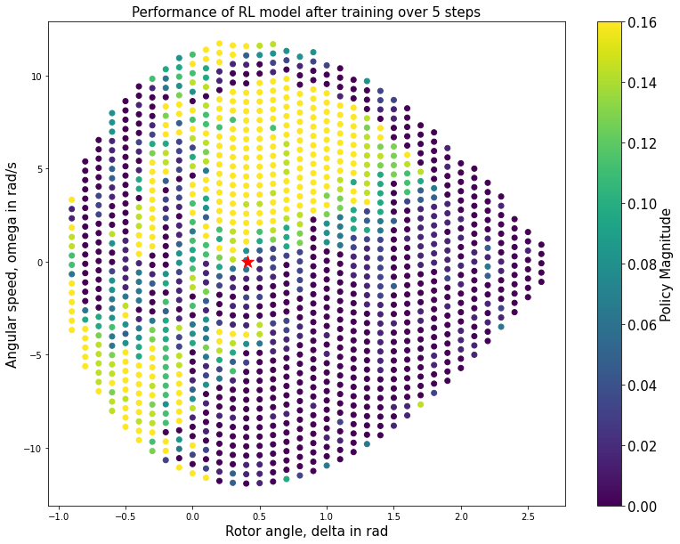
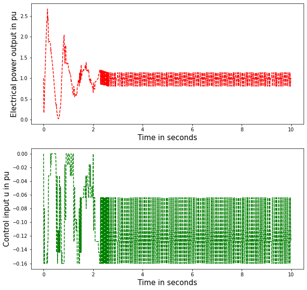
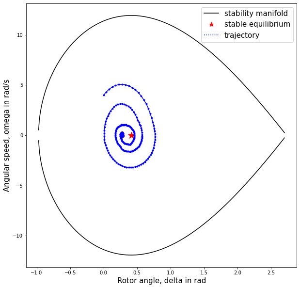

# Suppressing oscillations in power system: A Reinforcement Learning Approach
In this page we would look at a Reinforcement-learning (RL) based approach to model a controller which damps oscillations in the power system. We would try to cover the basics through the following topics.

- Power system stability problem
- Reinforcement Learning
- Q-learning in the context of power system
- Application and case studies

## Power system stability problem
A power grid is composed of a set of generators serving a set of loads (electric demand of consumers) through an interconnected system of transmission and distribution network. In such a setup, the job of a power system operator (who is sitting at his/her desk at a control center) is to maintain the **stable** operation of the power grid. 


```python
#Import necessary libraries
import numpy as np
import matplotlib.pyplot as plt
from matplotlib import cm
from matplotlib.lines import Line2D
from sklearn.ensemble import ExtraTreesRegressor as ETR
```


```python
# Define constants
M = 0.03183
Pm = 1.0
E = 1.0
V = 1.0
Xline = 0.4
```


```python
# Functions for equilibrium point and stability manifold
def compute_equilibrium():
    """
    Computes the stable equilibrium for the dynamic system
    Returns: tuple of stable equilibrium point
    """
    omega_stability = 0
    delta_stability = np.arcsin(Pm*Xline/(E*V))
    return (delta_stability,omega_stability)

def compute_stability_bound():
    """
    Compute the unstable equilibrium point and returns the total
    energy of the system at that point. This computes the stability
    boundary for the system.
    Returns: Total energy of system at unstable equilibrium
    """
    delta_stability = np.pi-np.arcsin(Pm*Xline/(E*V))
    return -(Pm*delta_stability)-(E*V/Xline)*np.cos(delta_stability)

def plot_stability_manifold(data=None):
    stability_bd = compute_stability_bound()
    delta_array = np.arange(-0.97,2.71,0.01)
    potential_energy = - Pm*delta_array - (E*V*np.cos(delta_array))/Xline
    omega_array = np.sqrt((2/M)*(stability_bd-potential_energy))
    eq = compute_equilibrium()
    
    fig = plt.figure(figsize=(10,10))
    ax = fig.add_subplot(111)
    ax.plot(delta_array,omega_array,color='k')
    ax.plot(delta_array,-omega_array,color='k')
    ax.set_ylabel("Angular speed, omega in rad/s",fontsize=15)
    ax.set_xlabel("Rotor angle, delta in rad",fontsize=15)
    ax.scatter(eq[0],eq[1],marker='*',c='red',s=200)
    if data != None:
        delta = [d[0] for d in data]
        omega = [d[1] for d in data]
        ax.plot(delta,omega,marker='.',c='blue')
    
    leglines = [Line2D([0], [0], color='black', markerfacecolor='black', marker='*',
                       markersize=0,linestyle='solid'),
                Line2D([0], [0], color='white', markerfacecolor='red', 
                       marker='*',markersize=15),
                Line2D([0], [0], color='blue', markerfacecolor='blue', marker='.',
                       markersize=0,linestyle='dotted')]
    ax.legend(leglines,['stability manifold','stable equilibrium','trajectory'],
              loc='best',ncol=1,prop={'size': 15})
    return
```


```python
# Class method for policy-perturb computation
class Perturb:
    """
    This class consists of methods and attributes required to perturb the 
    system from given operating point and compute cost or penalty.
    """
    def __init__(self):
        self.stability_bound = compute_stability_bound()
        return

    def check_stability(self,x):
        """
        Checks the stability of the system using Energy Function method
        
        Inputs: x:  tuple of floating point data
                    (delta,omega) of the generator
                    delta:  floating point data
                            the rotor angle of generator
                    omega:  floating point data
                            the rotor angular speed of generator
        
        Output: 1: if stable
                0: if unstable
        """
        (delta,omega) = x
        kinetic = 0.5*M*(omega**2)
        potential = -(Pm*delta)-(E*V*np.cos(delta)/Xline)
        return (kinetic+potential)<self.stability_bound

    
    def action(self,x,u,delta_t=0.05):
        """
        Perturbs the initial state x with the input u
        
        Inputs: x:  tuple of floating point data
                    (delta,omega) of the generator
                u:  floating point data
                    input perturbation
                delta_t:    floating point data, default is 0.05s
                            time increment
        Returns:
                tuple of new states: (new delta, new omega)
        """
        (delta_0,omega_0) = x
        Pe_0 = E*V*np.sin(delta_0)/(u+Xline)
        delta_new = delta_0 + omega_0*delta_t
        omega_new = omega_0 + (Pm-Pe_0)*delta_t/M
        return (delta_new,omega_new)

    def cost(self,x_old,x_new,u):
        """
        Computes the cost of the transition. The goal is to minimize the overall
        cost.
        
        Inputs: x_old:  tuple of floating point data
                        initial state
                x_new:  tuple of floating point data
                        final state
                u:  floating point data
                    input perturbation
        """
        s_old = self.check_stability(x_old)
        s_new = self.check_stability(x_new)
        
        if s_old == 1 and s_new == 0:
            return 1000
        elif s_old == 1 and s_new == 1:
            Pe_new = E*V*np.sin(x_new[0])/(Xline+u)
            return (Pe_new-Pm)**2
        else:
            return 0

    def create_tuple(self,x0,u0):
        """
        Creates the four-tuples (x0,u0,c0,x1) which will be used for training 
        the RL framework
        
        Inputs: x0: tuple of floating point data
                    initial state
                u0: floating point data
                    input perturbation
        """
        x1 = self.action(x0,u0)
        c0 = self.cost(x0,x1,u0)
        return np.array([x0[0],x0[1],u0,c0,x1[0],x1[1]])

```


```python
# Functions for sample generation to create training data
def getOmegaLimit(delta):
    stability_bd = compute_stability_bound()
    return np.sqrt((2/M)*(stability_bd+Pm*delta+(E*V*np.cos(delta))/Xline))

def sampleX(n_episodes):
    delta = np.random.uniform(low=-0.97,high=2.71,size=n_episodes).reshape(-1,1)
    lims = getOmegaLimit(delta)
    omega = np.random.uniform(low=-lims,high=lims)
    return np.hstack((delta,omega))

def get_Qmin(X0,X1,u,cost,T):
    """
    Gets the extra trees regressor model after training through multiple steps.
    Evaluates the suboptimal regressor for the infinite horizon problem. 

    Parameters
    ----------
    X0 : numpy 2D array of (n_samples,n_features)
         Each row indicate the episodes in the training data and columns indicate
         delta and omega in respective columns
    X1 : numpy 2D array of (n_samples,n_features)
         Each row indicate the episodes in the training data and columns indicate
         delta and omega in respective columns
    u : numpy 1D array (n_samples,)
        Each row indicates the episode and contains the control used in the 
        episode
    cost : numpy 1D array (n_samples,)
        Each row indicates the episode and contains the cost incurred in the 
        episode
    T : integer value
        number of time steps to consider.

    Returns
    -------
    TYPE
        DESCRIPTION.

    """
    gamma = 0.95
    n_samples = X0.shape[0]
    Xtrain = np.concatenate((X0,u),axis=1)
    for n in range(T):
        if n==0:
            ytrain = cost
            REGRESSOR = ETR(n_estimators=50).fit(Xtrain,ytrain)
        else:
            Qdata = np.zeros(shape=(n_samples,11))
            for i in range(11):
                udata = -i*0.016*np.ones(shape=(n_samples,1))
                Xdata = np.concatenate((X1,udata),axis=1)
                Qdata[:,i] = REGRESSOR.predict(Xdata)
            ytrain = cost + gamma*np.amin(Qdata, axis=1)
            REGRESSOR = ETR(n_estimators=50).fit(Xtrain,ytrain)
    return REGRESSOR


def simulate_episodes(n_episodes):
    Xs = sampleX(n_episodes)
    us = -0.016*np.random.randint(low=0,high=11,size=n_episodes)
    L = np.zeros(shape=(n_episodes,6))
    for i in range(n_episodes):
        p = Perturb()
        L[i,:] = p.create_tuple(Xs[i,:],us[i])
    print("Created 4-tuples.\n")
    return L
```


```python
# Generate tuples for 100,000 episodes
num_eps = 10000
L = simulate_episodes(num_eps)
X0_data = L[:,:2]
X1_data = L[:,-2:]
u_data = L[:,2].reshape(-1,1)
c_data = L[:,3]
```

    Created 4-tuples.
    
    


```python
# Figure to display how the samples are generated
fig = plt.figure(figsize=(13,10))
ax = fig.add_subplot(111)
ax.scatter(X0_data[:,0],X0_data[:,1],c=-u_data,cmap='viridis')
ax.set_ylabel("Angular speed, omega in rad/s",fontsize=15)
ax.set_xlabel("Rotor angle, delta in rad",fontsize=15)
ax.set_title("Training data set with 10000 episodes",fontsize=15)
cobj = cm.ScalarMappable(cmap='viridis')
cobj.set_clim(vmin=0.00,vmax=0.16)
cbar = fig.colorbar(cobj,ax=ax)
cbar.set_label('Policy Magnitude',size=15)
cbar.ax.tick_params(labelsize=15)
```





```python
# Training the model
T = 20
REG = get_Qmin(X0_data,X1_data,u_data,c_data,T)
print("Model trained over",T,"time steps")
```

    Model trained over 20 time steps
    


```python
# Apply on test data to get summary of training
def getTestData():
    Xtest = np.empty(shape=(0,2))
    delta = np.arange(start=-0.9,stop=2.7,step=0.1)
    for d in delta:
        omega_lim = getOmegaLimit(d)
        omega = np.arange(start=-omega_lim,stop=omega_lim,step=0.5)
        Xtest = np.vstack((Xtest,np.transpose([np.tile(d, len(omega)), omega])))
    return Xtest

def get_u(X,model):
    num_X = X.shape[0]
    Q_data = np.zeros(shape=(num_X,11))
    for i in range(11):
        u = -i*0.016*np.ones(shape=(num_X,1))
        X_data = np.concatenate((X,u),axis=1)
        Q_data[:,i] = model.predict(X_data)
    u_ind = np.argmin(Q_data,axis=1)
    return -0.016*u_ind
```


```python
# Testing the model on some test points
Xtest = getTestData()
u_best = get_u(Xtest,REG)
fig = plt.figure(figsize=(13,10))
ax = fig.add_subplot(111)
ax.scatter(Xtest[:,0],Xtest[:,1],c=-u_best,cmap='viridis')
eq = compute_equilibrium()
ax.scatter(eq[0],eq[1],marker='*',c='red',s=200)
ax.set_ylabel("Angular speed, omega in rad/s",fontsize=15)
ax.set_xlabel("Rotor angle, delta in rad",fontsize=15)
ax.set_title("Performance of RL model after training over 5 steps",fontsize=15)
cobj = cm.ScalarMappable(cmap='viridis')
cobj.set_clim(vmin=0.00,vmax=0.16)
cbar = fig.colorbar(cobj,ax=ax)
cbar.set_label('Policy Magnitude',size=15)
cbar.ax.tick_params(labelsize=15)
```





```python
#%% Infinite Time Horizon Simulation
x0 = (0,4)
eq = compute_equilibrium()
state = [x0]
Pe = [1]
policy = [0]
cost_scenario = 0
ptest = Perturb()
time = [0]
t_step = 0.01
for t in range(1000):
    # create a numpy version of the tuple
    X0 = np.array(list(x0)).reshape(1,-1)
    # best policy
    u = get_u(X0,REG)[0]
    # u=0
    time.append((t+1)*t_step)
    policy.append(u)
    # apply policy
    x1 = ptest.action(x0,u,t_step)
    state.append(x1)
    Pe.append(E*V*np.sin(x1[0])/(Xline+u))
    cost_scenario += ptest.cost(x0,x1,u)
    s = ptest.check_stability(x1)
    if s == 0:
        print("Unstable system at time step:",t)
        break
    else:
        x0 = x1
    
fig = plt.figure(figsize=(10,10))
ax1 = fig.add_subplot(211)
ax1.plot(time,Pe,'r--')
ax1.set_xlabel("Time in seconds",fontsize=15)
ax1.set_ylabel("Electrical power output in pu",fontsize=15)
ax2 = fig.add_subplot(212)
ax2.plot(time,policy,'g--')
ax2.set_xlabel("Time in seconds",fontsize=15)
ax2.set_ylabel("Control input u in pu",fontsize=15)

plot_stability_manifold(data=state)
```








```python

```
